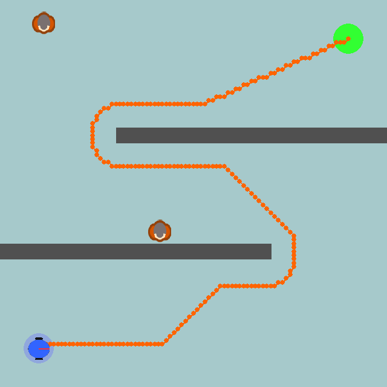
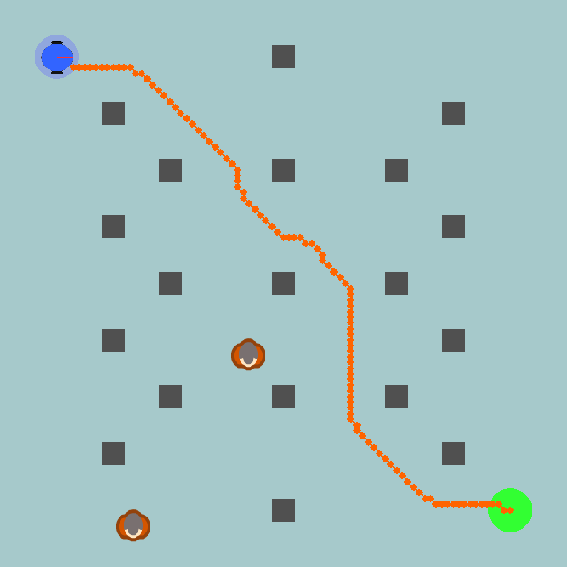
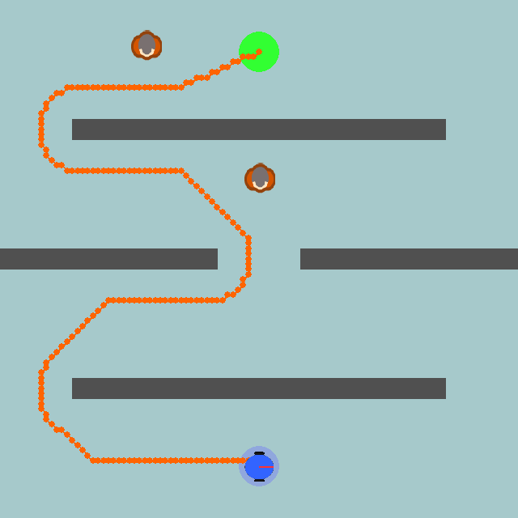
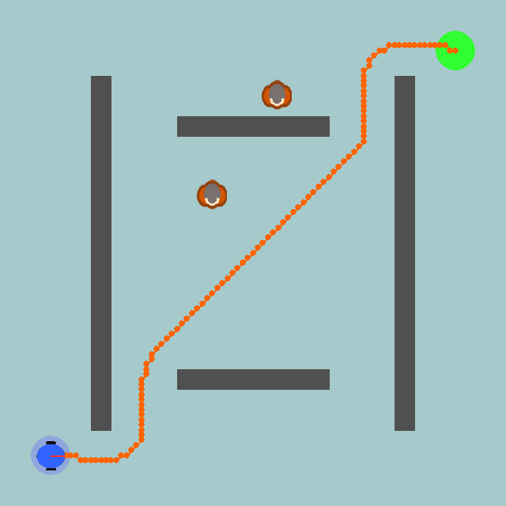

# Performance Improvement of Dynamic Window Approach (DWA) Using Fuzzy Logic in Robot Navigation Simulation in Dynamic Environments

An autonomous mobile robot simulation project for my undergraduate thesis, focused on improving the standard Dynamic Window Approach (DWA) with a Fuzzy Logic Controller. The system simulates a warehouse-like 2D environment, dynamic obstacles, noisy sensing, and motion planning under collision-avoidance constraints.

The repository includes a reproducible simulation entrypoint, experiment logging, and a clear separation between global path planning, local collision avoidance, and fuzzy weight adaptation.

## Project Summary

This project compares a standard DWA controller against a fuzzy-enhanced DWA controller. The robot navigates from a start position to a goal position while avoiding walls, static obstacles, and moving obstacles. A* is used to generate a global reference path, while DWA evaluates candidate velocities locally and selects the best action based on heading, velocity, and clearance scores.

The fuzzy controller dynamically adjusts the importance of those scores based on the current environment and robot state. In practice, this is intended to improve behavior in cluttered or changing scenes, where fixed weights can be too rigid.

## Key Features

- Dynamic Window Approach local planning for motion selection.
- Fuzzy Logic Controller for adaptive DWA weight tuning.
- A* global planning to produce a reference path and waypoint guidance.
- Box2D-based 2D physics simulation.
- Moving obstacles with randomized targets and velocities.
- LiDAR-style sensing with noise and sensor delay.
- Odometry noise to simulate real-world uncertainty.
- Single-episode and multi-episode experiment modes.
- JSON experiment logging to support analysis and reporting.
- Optional rendering and video capture.

## What Makes This Useful

- It demonstrates classical robotics algorithms applied in a complete simulation pipeline.
- It shows how fuzzy logic can be used to improve a motion-planning controller.
- It includes measurable outputs such as success rate, collisions, path efficiency, clearance, speed, smoothness, and replanning count.
- It is structured like a research project, but still easy to run and reproduce.

## Method Overview

The control pipeline works as follows:

1. The environment initializes the arena, walls, static obstacles, and dynamic obstacles.
2. A* computes a global path from the start to the goal.
3. DWA samples feasible linear and angular velocities inside the dynamic window.
4. Each candidate trajectory is scored by:
   - heading alignment,
   - forward velocity preference,
   - obstacle clearance.
5. If fuzzy mode is enabled, a fuzzy inference system updates the weight of each score before the final action is chosen.
6. The selected action is applied in the physics simulation.
7. Performance statistics are saved to `results/experiments_log.json`.

## Repository Structure

```text
.
├── run_simulation.py
├── experiments.py
├── requirements.txt
├── assets/
├── results/
│   └── experiments_log.json
└── src/
    ├── a_star.py
    ├── config.py
    ├── dwa.py
    ├── environment.py
    ├── fuzzy_controller.py
    ├── localization.py
    ├── renderer.py
    ├── robot.py
    └── simulation.py
```

## Requirements

- Python 3.9
- `Box2D`
- `pygame`
- `numpy`
- `scikit-fuzzy`

Install dependencies with:

```bash
pip install -r requirements.txt
```

## Installation

1. Clone the repository.
2. Create and activate a virtual environment.
3. Install the dependencies.

Example on Windows:

```powershell
python -m venv dwa
.\dwa\Scripts\Activate.ps1
pip install -r requirements.txt
```

## How to Run

### Run the main simulation

Use the root script:

```bash
python run_simulation.py
```

The script checks dependencies, verifies the expected source files, ensures the `assets/` directory exists, and then launches the simulation.

### Run a single episode without rendering

```bash
python src/simulation.py --no-render --episodes 1 --seed 42
```

### Run with fuzzy logic enabled

```bash
python src/simulation.py --fuzzy
```

### Save a video of the simulation

```bash
python src/simulation.py --save-video
```

### Run multiple episodes

```bash
python src/simulation.py --episodes 10 --no-render
```

## Experiment Mode

The repository also includes `experiments.py`, which is set up to run a larger experiment suite across multiple layouts, task setups, obstacle densities, and controller variants.

It compares:

- standard DWA with efficient weights,
- standard DWA with safety-oriented weights,
- standard DWA with balanced weights,
- fuzzy DWA.

This is the most relevant entrypoint if you want to reproduce thesis-style comparisons and generate aggregate performance logs.

Run it with:

```bash
python experiments.py
```

## Evaluation Setup

The thesis evaluation used 4 environment layouts and 2 dynamic conditions:

- low dynamics: 2 dynamic obstacles,
- high dynamics: 8 dynamic obstacles.

For each layout and dynamic condition, the following controllers were compared:

- Efficient DWA,
- Safety DWA,
- Balance DWA,
- Fuzzy DWA.

In total, the experiment log contains 32 experiment runs, with 50 episodes per run.

## Layouts Used

The four layouts used in the thesis are stored in the `layouts/` folder.

### Layout 1



### Layout 2



### Layout 3



### Layout 4



## Thesis Results

The table below summarizes the average performance across all 4 layouts and both dynamic conditions, based on the thesis experiment log in `results/experiments_log.json`.

| Controller | Success Rate | Mean Collisions | Mean Path Efficiency | Mean Clearance |
| --- | ---: | ---: | ---: | ---: |
| Efficient | 44.5% | 1.92 | 0.619 | 0.558 |
| Safety | 90.8% | 0.81 | 0.623 | 0.806 |
| Balance | 85.2% | 0.62 | 0.634 | 0.751 |
| Fuzzy | 95.8% | 0.62 | 0.596 | 0.803 |

The fuzzy controller achieved the highest overall success rate and matched the Balance controller on collision count, while remaining competitive in clearance and navigation reliability.

When grouped by environment difficulty, the averages were:

| Dynamic Condition | Success Rate | Mean Collisions | Mean Path Efficiency | Mean Clearance |
| --- | ---: | ---: | ---: | ---: |
| Low dynamics | 83.5% | 0.55 | 0.635 | 0.758 |
| High dynamics | 74.6% | 1.44 | 0.601 | 0.701 |

These results show the expected drop in performance under higher obstacle activity, which makes the fuzzy weight adaptation especially relevant for dynamic scenes.

## Configuration

Most simulation settings live in `src/config.py`.

Key configurable items include:

- arena size,
- robot size and mass,
- controller speed and acceleration limits,
- number and speed range of dynamic obstacles,
- LiDAR range and ray count,
- odometry and sensor noise,
- maximum episode length,
- stuck-time replanning threshold.

If you want to tailor the project for a thesis chapter, this file is the best place to document the main simulation assumptions.

## Output and Results

Each episode records metrics such as:

- success or failure,
- number of steps,
- elapsed simulation time,
- computation time,
- collision count,
- traveled distance,
- path efficiency,
- average speed,
- smoothness,
- minimum clearance,
- replanning count.

Aggregated results are appended to:

```text
results/experiments_log.json
```

## Assets

The project uses simple image assets for the robot and map tiles. If some assets are missing, the launcher can generate placeholder assets automatically.

Current tracked assets in this repository include:

- `assets/robot.png`
- `assets/tile.png`

## Typical Thesis Contribution

This project can be presented as a comparison study between fixed-parameter DWA and fuzzy-adaptive DWA in a dynamic environment. The thesis contribution is not just the implementation, but the evaluation of whether fuzzy weighting improves navigation behavior under uncertainty.

## Limitations and Future Work

- The environment is still a 2D simulation, so it does not capture full real-robot hardware complexity.
- The fuzzy rule base is manually defined and could be optimized further.
- Additional benchmarks against other planners could strengthen the thesis results.
- A real-world ROS or hardware deployment would be a natural next step.

## Troubleshooting

- If the simulation window does not open, verify that `pygame` is installed and that your Python environment is activated.
- If you see import errors, make sure the repository root contains the `src/` directory and that you are running commands from the project root.
- If assets are missing, run the launcher once so it can generate basic placeholders.
